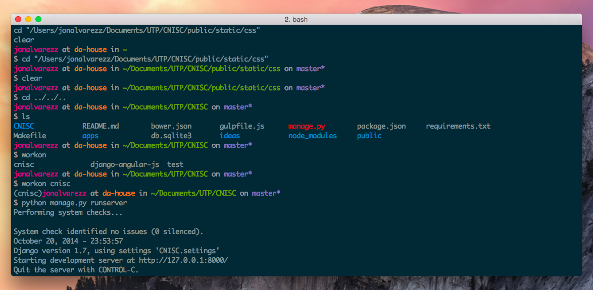

<iframe width="760" height="428" src="//www.youtube.com/embed/v1S5J39-93I?rel=0&amp;showinfo=0" frameborder="0" allowfullscreen></iframe>

> Programar es mejor cuando tu terminal se ve hermosa

iTerm2 es un reemplazo para las terminal por defecto de MAC OS X y trae un monton de caracterísitcas muy interesantes, preferida tanto por newbies como por viejos veteranos.

[Descargar iTerm2](http://iterm2.com)

En el video enseño las principales opciones a (des)habilitar en iTerm2, cómo configurar una nueva fuente y hacerle ver hermosa. También te muestro las **mejores fuentes para utilizar en tu consola o terminal**.

Si no desean ver el video acá se los especifico.

Abrir iTerm2 y entrar a su configuración `⌘` + `,`

1\. En la pestaña de **General**, desactivar **Confirm closing multiple sessions** y **Confirm "Quit iTerm2 (Cmd+Q)" command**

2\. Crear un nuevo perfil desde la pestaña de **Profiles** presionando el ícono `+` (abajo) y seleccionenlo como perfil por defecto en **Other Actions... > Set as Default** 

3\. *(Esto no aparece en el video)* Allí mismo, en la pestaña **General** (derecha) activar **Reuse previous session's directory**. Esto es para que al abrir una nueva pestaña/ventana de la terminal se sitúe por defecto en el directorio en el cual se esta trabajando.

4\. En la pestaña **Window** cambien el tamaño por defecto de la terminal. Un tamaño de 127x35 es promedio, aunque utilizo 140x26.

5\. Descargar el tema [Solarized](http://ethanschoonover.com/solarized), descomprimirlo.

6\. De vuelta en las preferencias de tu perfil que acabar de crear, en la parte inferior de la pestaña **Colors**, encontrarán un desplegable para cargar ajustes. Dan click **Load Presets > Import** y seleccionan el archivo dentro de la carpeta iTerm2 que viene con el tema Solarized. Hay un archivo para el tema oscuro y otro para un tema de colores claros.

7\. Luego de importado lo seleccionan **Load Presets > Solarized Dark/Light**

Hasta este momento se ha configurado iTerm2. Sin embargo para que tengamos muchos más colores y podamos personalizar más la consola hay que modificar unos archivos.

Si no tienes nada que perder en estos archivos, o no existían, que es lo más seguro, puedes reemplazarlos. En caso contrario copian y pegan así como realicé en el video.

La forma resumida es:

	$ cd ~
	$ curl -O https://raw.githubusercontent.com/nicolashery/mac-dev-setup/master/.bash_profile
	$ curl -O https://raw.githubusercontent.com/nicolashery/mac-dev-setup/master/.bash_prompt
	$ curl -O https://raw.githubusercontent.com/nicolashery/mac-dev-setup/master/.aliases

Lo que hace eso es situarse en tu carpeta de usuario y descargar los archivos de configuración para el `bash_profile`, `bash_prompt` y `aliases`

Otro archivo opcional es tener más colores al usar Git.

	$ cd ~
	$ curl -O https://raw.githubusercontent.com/nicolashery/mac-dev-setup/master/.gitconfig

*Todos estos archivos hacen parte de [Nicolas Henry](https://github.com/nicolashery). Pueden encontrar más tweaks para configurar su MAC en su repositorio [mac-dev-setup](https://github.com/nicolashery/mac-dev-setup). Aunque realmente lo más interesante es esto para iTerm. No vayan a instalar Homebrew por amor a Batman.*

Con esto su terminal lucirá algo como:

En el video muestro cómo cambiar el hostname, que en mi caso lo tengo como "da house"

## Mejores fuentes para las terminales

En particular, estas son las fuentes que más me gustan.

1\. [Inconsolata](http://www.google.com/fonts/specimen/Inconsolata)
2\. Monaco (Viene con MAC OSX)
3\. [Droid Sans Mono](http://www.google.com/fonts/specimen/Droid+Sans+Mono)
4\. En su defecto, Consolas. Viene con Windows.

¿Conoces algún otro *tweak* hermoso?

