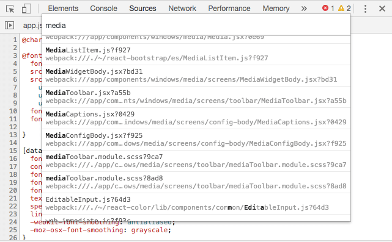
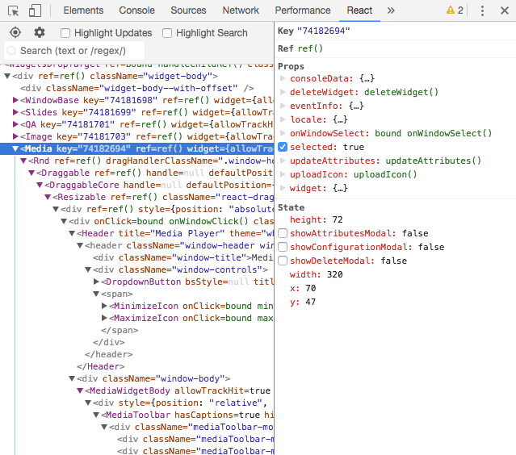

> Debugging a React application might be very confusing.

If you are not familiar with bundlers, compilers, JSX and all that _modern JavaScript_ stuff, you might spend a lot of time trying to debug your application.

Let me introduce you three ways that might help you:

## 1. Use the `debugger` statement.

You just need to put the `debugger` statement in the line of code you want the browser to stop the JavaScript execution, as a breakpoint.

```javascript
// posible buggy line of code
const b = ...
debugger
```

> Do not forget to remove those debugger statements once you're done.

## 2. Add breakpoints from Chrome's DevTool.

<div class="text-center">


</div>

Getting those kind of errors are not very helpful, right? Even if you manage to open your bundle.js file without your Text editor to hang for some minutes, most probably is you won't be able to know where is that line coming from.

That's the reason why all bundlers will give you the option to produce source maps with your bundled files, allowing the browser to show you in which of your JavaScript files, the error occurred.

<div class="text-center">


</div>

To add a breakpoint from Chrome's DevTools, open the **Source** tab, hit `CMD` + `p` keys (`CTRL` if you on Windows) to search for your file, and then click the line number you want the breakpoint to be added.

<div class="text-center">



</div>

There are some bugs adding breakpoints to source maps, like breakpoint been added in another line different to the clicked one, but it'll work most of the times.

## 3. Use React DevTools

There is a very useful Chrome's extension that allows you to search through your rendered React Components as a DOM tree, you can inspect them, see their props, ref, and state.

<div class="text-center">



</div>

You can go to the [React DevTools official GitHub repository](https://github.com/facebook/react-devtools) to get more information and installation instructions.

## 4. `console.log`

Well, and if nothing works, just console.log all the things.

Is there any other handy way you use to debug React apps?
