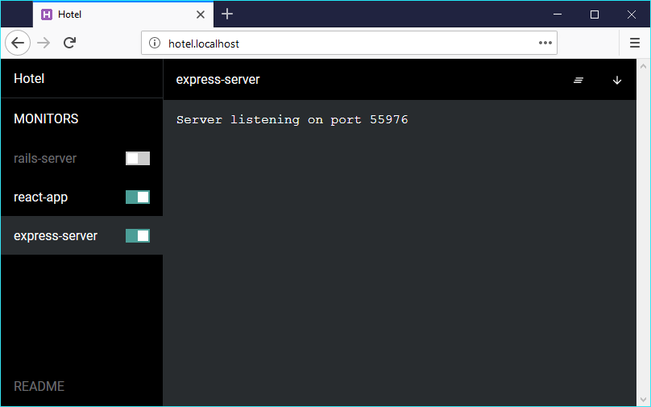

This is a way to get your WordPress site running in a breeze with no need to install a server like Apache or Nginx.

**Heads Up!** This configuration is only meant to be used in development, do not use this in production.

## 1. Download WordPress and set up your database.

Same old, same old.

If you are using MacOS, the painless way to get MySQL running is through [brew](https://brew.sh)

```
brew install mysql@5.7
```

**Heads Up!** We are specifying the version as Brew will install the latest MySQL by default, which is 8.xx, and it may be incompatible with some PHP features like `caching_sha2_password`, see https://stackoverflow.com/a/49950165.

## 2. Use any PHP version above 5.4

By the way, I had issues with PHP 7+, therefore [I used Brew to install PHP 5.6.](https://getgrav.org/blog/macos-mojave-apache-multiple-php-versions)

## 3. You're done.

Here is the trick. PHP introduced a built-in web server starting version 5.4, and it works for running WordPress.

Open your terminal and launch your site with:

```
cd /your/wordpress/installation/path
php -S 127.0.0.1:8000
```

That's it, going to http://127.0.0.1:8000/ will load your WordPress site.

Would you prefer to use an URL like http://myAwesomeSite.localhost instead of http://127.0.0.1:8000/? Keep reading...

## Bonus: Introducing Hotel

This is one of my favorite tiny but tremendously useful applications when developing.

Hotel allows you to manage your local sites from a single dashboard and plus it makes it stupidly easy to get your sites to use `.locahost` domains. How awesome is that?

<div class="text-center">



</div>

You can find the installation steps in [Hotel official repository](https://github.com/typicode/hotel)

Once you got Hotel installed and running, you can add your WordPress site by running:

```
cd /your/wordpress/installation/path
hotel add 'php -S 127.0.0.1:$PORT'
```

And now, your site will be available in http://hotel.localhost/ and http://yourWordpressFolderName.localhost/

If you are on Windows, the command lines may change, make sure to follow the [official documentation](https://github.com/typicode/hotel#port).

## Conclusion

Being able to get rid of Apache or Nginx to run your WordPress site locally is a huge time saver, no need to deal with virtual hosts nor `.conf` files.
